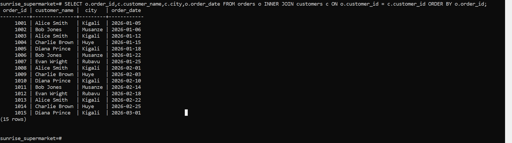
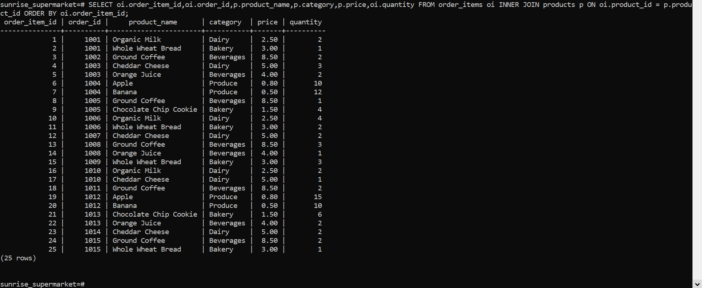
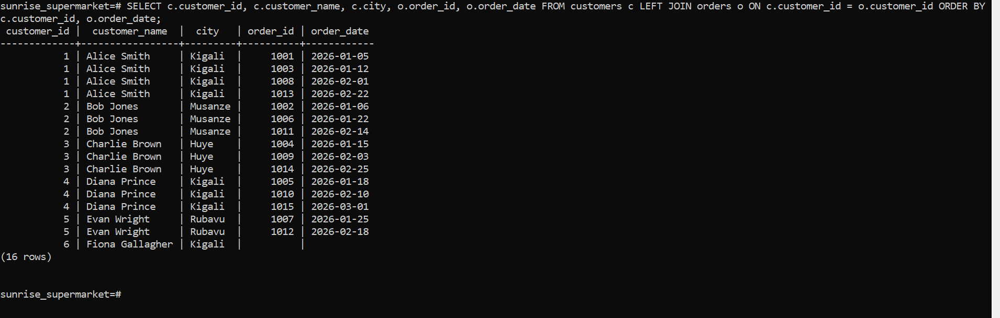
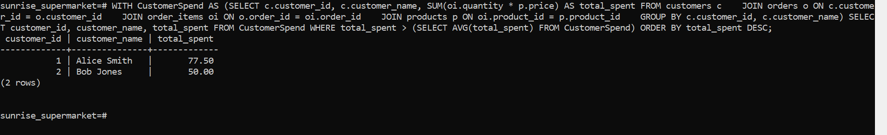
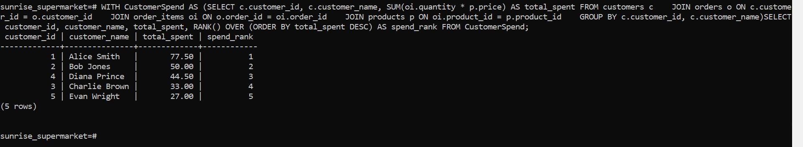
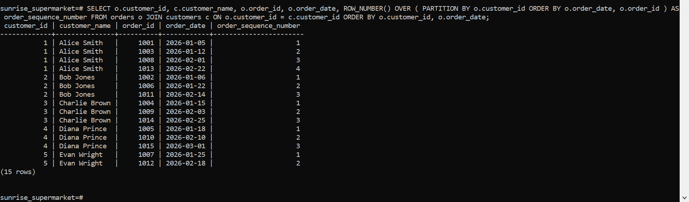
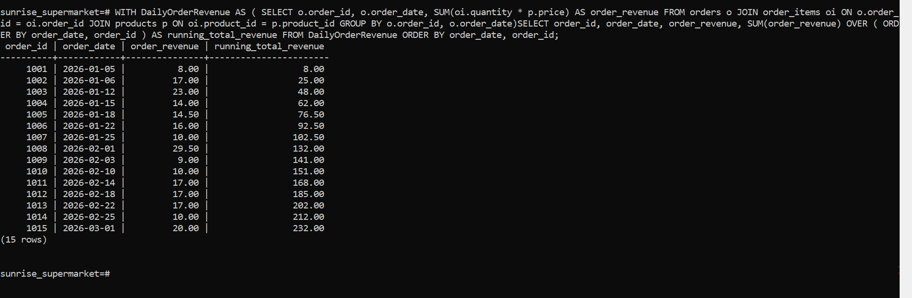
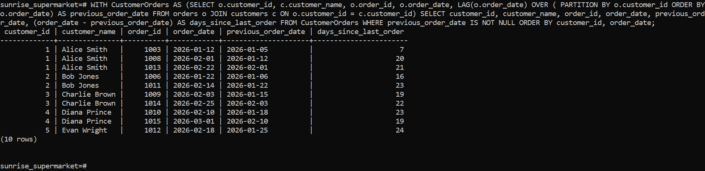

# PLSQL Assignment One - Sunrise Supermarket

**Student Name:** MUGISHA Elyse
**Student ID:** 20251IMA004
**Repository Name:** `assignmet1-MUGISHA-Elyse-20251IMA004`

---

## 1. Business Scenario Overview

Sunrise Supermarket provides a range of products to retail customers in different cities throughout Rwanda. The database manages customer information, sales orders, products and their categories, as well as individual items included in each transaction.

The management team requires structured data analysis to identify high-spending customers, understand customer purchasing frequency, monitor cumulative revenue over time, and identify registered customers who have not yet made any purchases.

---

## 2. Queries, Explanations & Execution Results

### Question 1: INNER JOIN — Orders + Customers

**Description:**
Displays each order together with the customer's name, city, and order date.

**Explanation:**
An `INNER JOIN` connects the `orders` table with the `customers` table using the matching `customer_id` field.

```sql
SELECT  
    o.order_id, 
    c.customer_name, 
    c.city, 
    o.order_date 
FROM orders o 
INNER JOIN customers c ON o.customer_id = c.customer_id 
ORDER BY o.order_id;
```

**Output Screenshot:**



---

### Question 2: JOIN — Order Items + Products

**Description:**
Displays every item included in an order together with the product name, category, unit price, and quantity purchased.

```sql
SELECT  
    oi.order_item_id, 
    oi.order_id, 
    p.product_name, 
    p.category, 
    p.price, 
    oi.quantity 
FROM order_items oi 
INNER JOIN products p ON oi.product_id = p.product_id 
ORDER BY oi.order_item_id;
```

**Output Screenshot:**



---

### Question 3: LEFT JOIN — Customers + Orders

**Description:**
Displays all registered customers and their corresponding orders. Customers who have never placed an order are also included.

```sql
SELECT  
    c.customer_id, 
    c.customer_name, 
    c.city, 
    o.order_id, 
    o.order_date 
FROM customers c 
LEFT JOIN orders o ON c.customer_id = o.customer_id 
ORDER BY c.customer_id, o.order_date;
```

**Output Screenshot:**



---

### Question 4: CTE for High Spenders

**Description:**
Calculates the total amount spent by each customer and returns customers whose spending is greater than the average spending of the customer population.

```sql
WITH CustomerSpend AS ( 
    SELECT  
        c.customer_id, 
        c.customer_name, 
        SUM(oi.quantity * p.price) AS total_spent 
    FROM customers c 
    JOIN orders o ON c.customer_id = o.customer_id 
    JOIN order_items oi ON o.order_id = oi.order_id 
    JOIN products p ON oi.product_id = p.product_id 
    GROUP BY c.customer_id, c.customer_name 
)
SELECT  
    customer_id, 
    customer_name, 
    total_spent 
FROM CustomerSpend 
WHERE total_spent > (SELECT AVG(total_spent) FROM CustomerSpend) 
ORDER BY total_spent DESC;
```

**Output Screenshot:**



---

### Question 5: Rank Customers by Spend

**Description:**
Ranks customers according to their total spending, starting with the customer who has spent the highest amount.

```sql
WITH CustomerSpend AS ( 
    SELECT  
        c.customer_id, 
        c.customer_name, 
        SUM(oi.quantity * p.price) AS total_spent 
    FROM customers c 
    JOIN orders o ON c.customer_id = o.customer_id 
    JOIN order_items oi ON o.order_id = oi.order_id 
    JOIN products p ON oi.product_id = p.product_id 
    GROUP BY c.customer_id, c.customer_name 
)
SELECT  
    customer_id, 
    customer_name, 
    total_spent, 
    RANK() OVER (ORDER BY total_spent DESC) AS spend_rank 
FROM CustomerSpend;
```

**Output Screenshot:**



---

### Question 6: Number Customer Orders Sequentially

**Description:**
Assigns a sequential number to every order made by a customer according to the date of purchase.

```sql
SELECT  
    o.customer_id, 
    c.customer_name, 
    o.order_id, 
    o.order_date, 
    ROW_NUMBER() OVER ( 
        PARTITION BY o.customer_id  
        ORDER BY o.order_date, o.order_id 
    ) AS order_sequence_number 
FROM orders o 
JOIN customers c ON o.customer_id = c.customer_id 
ORDER BY o.customer_id, o.order_date;
```

**Output Screenshot:**



---

### Question 7: Running Total of Revenue

**Description:**
Calculates the cumulative sales revenue over time, with each order contributing to the overall running total.

```sql
WITH DailyOrderRevenue AS ( 
    SELECT  
        o.order_id, 
        o.order_date, 
        SUM(oi.quantity * p.price) AS order_revenue 
    FROM orders o 
    JOIN order_items oi ON o.order_id = oi.order_id 
    JOIN products p ON oi.product_id = p.product_id 
    GROUP BY o.order_id, o.order_date 
)
SELECT  
    order_id, 
    order_date, 
    order_revenue, 
    SUM(order_revenue) OVER ( 
        ORDER BY order_date, order_id 
    ) AS running_total_revenue 
FROM DailyOrderRevenue 
ORDER BY order_date, order_id;
```

**Output Screenshot:**



---

### Question 8: Days Passed Between Orders

**Description:**
Calculates the number of days between consecutive purchases made by the same customer. Only customers with previous orders are included.

```sql
WITH CustomerOrders AS ( 
    SELECT  
        o.customer_id, 
        c.customer_name, 
        o.order_id, 
        o.order_date, 
        LAG(o.order_date) OVER ( 
            PARTITION BY o.customer_id  
            ORDER BY o.order_date 
        ) AS previous_order_date 
    FROM orders o 
    JOIN customers c ON o.customer_id = c.customer_id 
)
SELECT  
    customer_id, 
    customer_name, 
    order_id, 
    order_date, 
    previous_order_date, 
    (order_date - previous_order_date) AS days_since_last_order 
FROM CustomerOrders 
WHERE previous_order_date IS NOT NULL 
ORDER BY customer_id, order_date;
```

**Output Screenshot:**



---

## 3. Business Interpretation

### 1. High-Value Customers

Among the 5 customers who have made purchases, **Alice Smith ($77.50)** and **Bob Jones ($50.00)** have spending amounts above the customer average of **$46.40**.

Management can use this information to create loyalty programs or VIP rewards for customers with higher spending levels.

### 2. Purchase Frequency

The analysis shows that repeat customers have approximately **7 to 24 days** between purchases.

Management could use this information to schedule re-engagement messages around the **15-day period** to encourage customers to return and make another purchase.

### 3. Inactive Customer Accounts

The `LEFT JOIN` identifies **Fiona Gallagher (Customer ID 6)** as a registered customer who has not placed any orders.

The supermarket could provide welcome discounts or introductory offers to encourage registered customers who have not purchased to make their first transaction.

### 4. Revenue Progress

The cumulative revenue increased from **$8.00 on 2026-01-05** to **$232.00 on 2026-03-01**.

This shows that sales revenue continued to accumulate during the first quarter.

---

## 4. Challenges Encountered & Resolutions

### Challenge 1: Calculating Running Revenue

Calculating cumulative revenue required the order items to be joined and aggregated before calculating the running total based on order dates.

**Resolution:**

A CTE named `DailyOrderRevenue` was created to calculate the revenue for each order first. The resulting order-level revenue was then used with a window function to calculate the cumulative revenue.

### Challenge 2: Calculating Date Differences

Calculating the number of days between consecutive orders required a PostgreSQL-compatible date subtraction method.

**Resolution:**

PostgreSQL's native date subtraction was used:

```sql
(order_date - previous_order_date)
```

This returns the number of days between the two dates directly.

---

## 5. How to Run

### Step 1: Open SQL Shell

Launch **SQL Shell (psql)**.

### Step 2: Connect to the Database

Connect to the Sunrise Supermarket database:

```sql
\c sunrise_supermarket
```

### Step 3: Run the Database Setup

Execute the table definitions and seed data:

```sql
\i 'path/to/setup.sql'
```

### Step 4: Run the Analytical Queries

Execute the analytical SQL queries:

```sql
\i 'path/to/queries.sql'
```

---

## 6. Project Structure

A recommended repository structure is:

```text
assignmet1-MUGISHA-Elyse-20251IMA004/
│
├── README.md
├── setup.sql
├── queries.sql
│
└── screenshots/
    ├── result1.PNG
    ├── result2.PNG
    ├── result3.PNG
    ├── result4.PNG
    ├── result5.PNG
    ├── result6.PNG
    ├── result7.PNG
    └── result8.PNG
```

---

## 7. Technologies Used

* **PostgreSQL 16**
* **SQL Shell (psql)**
* SQL JOIN operations
* Common Table Expressions (CTEs)
* Window functions
* Aggregate functions
* Date calculations
* `INNER JOIN`
* `LEFT JOIN`
* `RANK()`
* `ROW_NUMBER()`
* `LAG()`

---

## 8. Conclusion

This assignment demonstrates the use of PostgreSQL to analyze supermarket sales data using different SQL techniques.

The queries demonstrate how joins, aggregate functions, Common Table Expressions, and window functions can be combined to obtain useful information about customer spending, purchasing behavior, revenue progression, and inactive customer accounts.

The analysis provides a practical example of how a relational database can support business reporting and decision-making.
